# Heatmiser edge — User Manual

Transcribed from [`Edge-Manual.pdf`](Edge-Manual.pdf) (Rev. 1.1). The booklet's page numbers are not
reproduced; its internal cross-references are links to the [Contents](#contents) sections instead.

Figures that carry information the text does not — the LCD callouts, the wiring diagrams, the
Modbus termination switch — are rendered from the PDF into [`edge-manual/`](edge-manual/) and
linked in place. Purely decorative photographs are not reproduced.

**Key notation.** The manual writes its keys as icons; they are transcribed as:

| Symbol | Key |
|---|---|
| `[✓]` | the tick / confirm key |
| `[∧]` `[∨]` | Up, Down |
| `[<]` `[>]` | Left, Right |
| `[⏻]` | the power icon in the on-screen menu bar |
| `[🔒]` | the keypad-lock indicator |

---

## Contents

- [What is a Programmable Room Thermostat?](#what-is-a-programmable-room-thermostat)
- [Installation Procedure](#installation-procedure)
- [Mode Select](#mode-select)
- **[Mode 1 — Thermostat](#mode-1--thermostat)**
  - [LCD Display](#lcd-display)
  - [Power On/Off](#power-onoff)
  - [Setting the Time and Date](#setting-the-time-and-date)
  - [Temperature Display](#temperature-display)
  - [Pairing Accessories](#pairing-accessories)
  - [View Accessories](#view-accessories)
  - [Removing Accessories](#removing-accessories)
  - [Edit Comfort Levels](#edit-comfort-levels)
  - [Temperature Control](#temperature-control)
  - [Temperature Hold](#temperature-hold)
  - [Advance](#advance)
  - [Frost Protection](#frost-protection)
  - [Locking / Unlocking the edge](#locking--unlocking-the-edge)
  - [Holiday](#holiday)
  - [Optional Settings Explained](#optional-settings-explained)
  - [Optional Settings — Feature Table](#optional-settings--feature-table)
  - [Adjusting the Optional Settings](#adjusting-the-optional-settings)
  - [Fail Safe](#fail-safe) / [Modbus](#modbus)
  - [Re-calibrating the edge](#re-calibrating-the-edge)
  - [Error Codes](#error-codes)
  - [Wiring Diagrams](#wiring-diagrams)
- **[Mode 2 — Time Clock](#mode-2--time-clock)**
  - [LCD Display](#lcd-display-1)
  - [Setting the Switching Times](#setting-the-switching-times)
  - [Timer Advance](#timer-advance)
  - [Timer Override](#timer-override)
  - [Optional Settings Explained (Time Clock)](#optional-settings-explained-time-clock)
  - [Optional Settings — Feature Table (Time Clock)](#optional-settings--feature-table-time-clock)
  - [Adjusting the Optional Settings (Time Clock)](#adjusting-the-optional-settings-time-clock)
- [Replacing the Battery](#replacing-the-battery)
- [Want More Information?](#want-more-information)

---

## What is a Programmable Room Thermostat?

A programmable room thermostat is both a programmer and a room thermostat. A programmer allows you
to set "On" and "Off" periods to suit your own lifestyle.

A room thermostat works by sensing the air temperature, switching on the heating when the air
temperature falls below the thermostat setting, and switching it off once this set temperature has
been reached.

So a programmable room thermostat lets you choose what times you want the heating to be on, and what
temperature it should reach while it is on. It will allow you to select different temperatures in
your home at different times of the day (and days of the week) to meet your particular needs and
preferences.

Setting a programmable room thermostat to a higher temperature will not make the room heat up any
faster. How quickly the room heats up depends on the design and size of the heating system.

Similarly reducing the temperature setting does not affect how quickly the room cools down. Setting
a programmable room thermostat to a lower temperature will result in the room being controlled at a
lower temperature, and saves energy.

The way to set and use your programmable room thermostat is to find the lowest temperature settings
that you are comfortable with at the different times you have chosen, and then leave it alone to do
its job.

The best way to do this is to set the room thermostat to a low temperature – say 18 °C, and then turn
it up by 1 °C each day until you are comfortable with the temperature. You won't have to adjust the
thermostat further. Any adjustment above this setting will waste energy and cost you more money.

You are able to temporarily adjust the heating program by overriding or using the temperature hold
feature. These features are explained further under [Temperature Control](#temperature-control) and
[Temperature Hold](#temperature-hold).

Programmable room thermostats need a free flow of air to sense the temperature, so they must not be
covered by curtains or blocked by furniture. Nearby electric fires, televisions, wall or table lamps
may also prevent the thermostat from working properly.

---

## Installation Procedure

**Do**
- Mount the edge at eye level.
- Read the instructions fully so you get the best from our product.

**Don't**
- Do not install near to a direct heat source as this will affect functionality.
- Do not push hard on the LCD screen as this may cause irreparable damage.

> *This thermostat is designed to be flush mounted and requires a back box of 35 mm (minimum depth)
> to be sunk into the wall prior to installation.*

**Step 1** — Using a small screwdriver, slightly loosen the screw from the bottom face of the
thermostat. You can then carefully separate the front half from the back plate.

**Step 2** — Place the edge LCD front plate somewhere safe. Terminate the edge as shown in the
[Wiring Diagrams](#wiring-diagrams).

**Step 3** — Screw the edge back plate securely into the back box.

**Step 4** — Replace the front of the thermostat onto the back plate, by locating the pins in the
socket then insert the top edge first. Now push in the bottom edge, securing it in place with the
retaining screw.

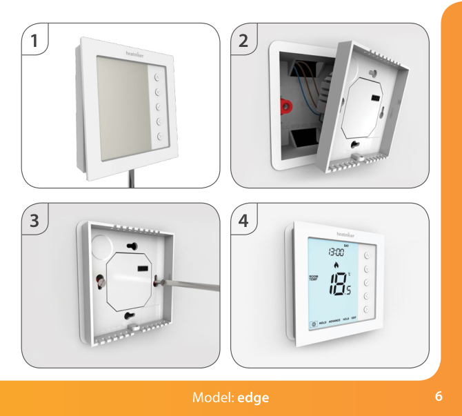

---

## Mode Select

Edge can either be used as a thermostat or a time clock. Thermostat mode is the default setting.

To change between thermostat & time clock modes, follow these steps.

- Use the 'Left/Right' arrow keys to highlight `[⏻]` then press and **hold** the `[✓]` button for
  3 seconds.
  *At this point the screen will go blank showing only 'SETUP' and 'CLOCK'.*
- Tap either of the 'Up' or 'Down' arrow keys to highlight 'SETUP', then **hold** the `[✓]` key for
  10 seconds.
  *The edge will factory reset then provide 2 selectable mode options.*
- Use the Left/Right keys to scroll between modes:
  - **Mode 1 = Thermostat**
  - **Mode 2 = Time Clock**

  *Note: the selected option will flash.*
- Press the `[✓]` key to confirm selection.

The edge will reset all parameters and restart in the selected mode.

> *Note: The Mode Select function will reset all parameters (Wireless Air Sensors and Window/Door
> Contacts excluded) that were entered during the set-up operations. These processes must be
> repeated after the restart has completed.*

---

# Mode 1 — Thermostat

## LCD Display

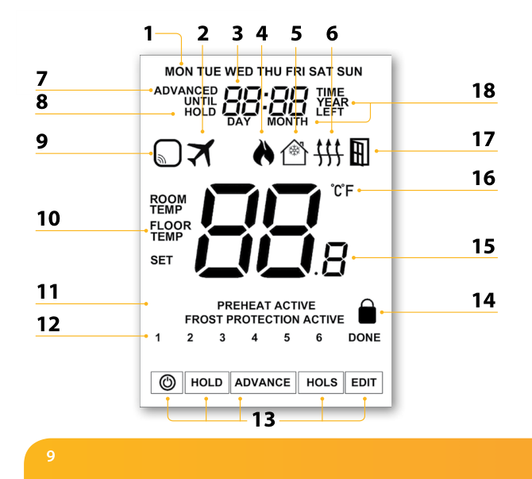

1. **Day Indicator** — Displays the day of the week.
2. **Holiday** — Displayed when the thermostat is in holiday mode.
3. **Clock** — Time displayed in 24 hour format.
4. **Flame Symbol** — Displayed when the thermostat is calling for heat and flashes when optimum
   start is active.
5. **Frost Protection** — Displayed when frost protection is enabled or activated by a Window/Door
   Switch.
6. **Floor Limit Symbol** — Displayed when the floor probe has reached the floor temperature limit
   configured in the setup menu.
7. **Advanced Until** — Displayed when the edge is advanced to the next programmed comfort level.
8. **Hold Left** — Displayed when a temperature hold is active, the remaining time will be shown.
9. **Sensor Warning** — Flashes on screen when the edge has failed to receive a signal from a
   Wireless Sensor or Window/Door Switch.
10. **Floor/Room Temp & Set** — Indicates the displayed sensor mode and when changes are being made
    to the current set point.
11. **Active Status** — Indication for 'Preheat' and 'Frost Protection' modes.
12. **Program Indicator** — Displayed during programming to show which period is being altered.
13. **Main Menu** — Highlighted text indicates selected option.
14. **Keypad Lock Indicator** — Displayed when the keypad is locked.
15. **Temperature** — Displays the current sensor temperature.
16. **Temperature Format** — Degrees Celsius or Fahrenheit.
17. **Window Icon** — Displays when Window/Door Switch is triggered.
18. **Time/Day/Month/Year** — Displays when setting the Clock/Calender or a Holiday Period.

---

## Power On/Off

The heating is indicated ON when the flame icon is displayed. When the Flame Icon is absent, there
is no requirement for heating to achieve the set temperature but the edge remains active.

- To turn the edge off completely, scroll to the Power Icon and hold the `[✓]` key for approximately
  3 seconds until the display goes blank.
  *The display and heating output will be turned OFF.*
- To turn the edge back ON, press the `[✓]` key once.

---

## Setting the Time and Date

To set the clock, follow these steps.

- Use the 'Left/Right' arrow keys to highlight `[⏻]` then press and **hold** the `[✓]` button for
  3 seconds.
  *At this point the screen will go blank showing only 'SETUP' and 'CLOCK'.*
- Tap the 'Up' followed by 'Right' keys to highlight 'CLOCK'.
- Press `[✓]` to confirm selection ('Hour' digits will now flash).
- Use the 'Up/Down' arrow keys followed by `[✓]` to set the 'Hours'.
- Use the 'Up/Down' arrow keys followed by `[✓]` to set the 'Minutes'.

  *Repeat the previous two steps to set the date ('Day, Month & Year'). Display will go blank once
  completed.*
- Press the 'Down' arrow key followed by `[✓]` to return to the main display.

---

## Temperature Display

This edge can be configured for different sensor options such as built[-in] sensor, floor sensor or
both. The display will clearly indicate which sensor is being used by showing either 'ROOM TEMP' or
'FLOOR TEMP' to the left [of] the actual value.

When the edge is set to use both the air & the floor sensor, the room temperature will be displayed
by default.

- To view the current floor temperature, press and hold the Left and Right arrow keys for 5 seconds,
  the floor temperature will then be displayed.

---

## Pairing Accessories

Wireless Air Sensor. Door/Window – Wireless Contact Sensor. *(Not available in Time Clock mode.)*

You can pair a total of **16 accessories** to a single edge thermostat.

**Wireless Air Sensor** — Once a remote sensor is added, the edge will automatically display an
average temperature between the 'Wireless Air Sensor' and the on-board sensor inside the thermostat.
Averaging will also be calculated between multiple Air Sensors.

**Window/Door Wireless Contact Sensor** — If any one of the 'Window/Door' contacts is broken, the
edge thermostat will be alerted and will activate 'Frost Protection' mode. The display will show the
window icon to indicate a window or door has been opened. Heating will not resume while this icon
remains on screen.

**Pairing the Air Sensor and Window/Door Contact**

- Use the 'Left/Right' arrow keys to highlight `[⏻]` then press and **hold** the `[✓]` button for
  3 seconds to turn off the display.
- Tap the 'Up' key to select 'Setup' then press `[✓]`.
- Press the 'Down' key until you see the letter **'P'** displayed at the top of the screen, then
  press `[✓]`.

The thermostat will now start a **99 second countdown**. During this time multiple sensors can be
added.

- On the 'Air Sensor & Window/Door Contact', press and hold the pairing button for 5 seconds. The
  LED will glow red to indicate pairing status.

If the sensor has successfully paired, the LED will go out after a few seconds. The thermostat
display will then show '01:P' to indicate that the first accessory has joined. If countdown time
elapses before all accessories have been paired, restart the countdown to add further sensors
following the previous steps.

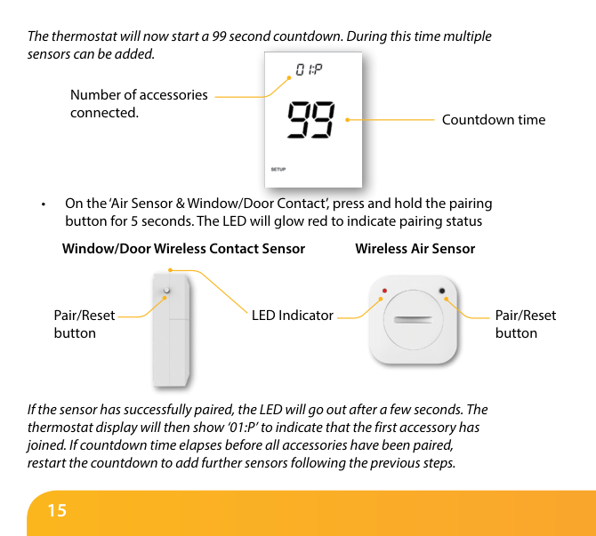

---

## View Accessories

- Use the 'Left/Right' arrow keys to highlight `[⏻]`. Press and hold `[✓]` for 3 seconds to turn off
  the display.
- Tap the 'Up' key to select 'Setup' then press `[✓]`.
- Press the 'Down' key until you see the letter **'A'** displayed at the top of the screen, then
  press `[✓]`.
- Use the 'Left/Right' arrow keys to scroll through the list of attached accessories.

A 'Wireless Air Sensor' will show the current temperature. The 'Window/Door Contact' will display
current open or closed status by showing **'OP' = Open**, or **'CL' = Closed**. If the edge loses
connection with an accessory, the display will show **"--"**.

A battery warning symbol will appear when an accessory reports low power. When this happens change
the **Lithium Cell CR2302 3 V** battery as soon as possible.

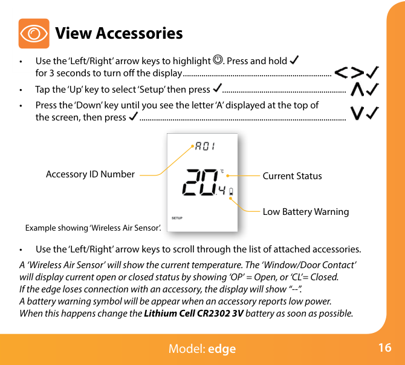

---

## Removing Accessories

There are two ways to remove an accessory from the edge thermostat.

**On the Sensor/Switch**

- Press and hold down the pairing/reset button for 15 seconds on the 'Sensor/Switch'. LED indicator
  will flash 3 times to confirm reset.

At this point the 'Sensor/Contact' will notify the edge that it has left, and will automatically be
removed from the 'Accessory Menu'.

**On the edge thermostat**

- Follow the steps under [View Accessories](#view-accessories) to enter the accessory menu.
- Press the 'Left/Right' arrow keys to view the accessory that will be deleted.
- Press and hold down the `[✓]` button for 10 seconds until the sensor disappears from the menu.

> *Note: You will also need to reset the sensor at this point.*

---

## Edit Comfort Levels

The edge offers three program mode options: Weekday/Weekend, 7 Day and 24 Hour programming. There is
also the option to use the edge as a manual thermostat.

The thermostat is supplied with comfort levels already factory programmed, but these can be changed
easily. The default times and temperature settings are:

| Level | Time | Temperature |
|---|---|---|
| Level 1 | 07:00 | 21 °C |
| Level 2 | 09:00 | 16 °C |
| Level 3 | 16:00 | 21 °C |
| Level 4 | 22:00 | 16 °C |

Unused levels must be set to `--:--` so that the edge will skip these and continue on to the next
programmed time.

For Weekday/Weekend programming, the four comfort levels are the same for Mon–Fri, but can be
different for Sat–Sun. For 7 Day programming each day of the week can have four different comfort
levels. In 24 Hour mode all days are programmed with the same comfort levels.

- To program the 'Comfort Levels', use the 'Left/Right' keys to scroll to 'EDIT'.
- Press `[✓]` to confirm selection.
- Use the 'Left/Right' keys to select day/period of week (the selection will flash).
- Press `[✓]` to confirm selection.
  *'Level 1' will now flash and the current time and temperature setting will be shown.*
- Press `[✓]` to alter 'Level 1' settings.
- Use the 'Up/Down' keys to set the 'Hours'.
- Press `[✓]` to confirm.
- Use the 'Up/Down' keys to set the 'Minutes'.
- Press `[✓]` to confirm.
- Use the 'Up/Down' keys to set the temperature.
- Press `[✓]` to confirm the settings.
- Press the 'Right' arrow key.
  *'Level 2' will now flash and the current settings will be displayed.*
- Press `[✓]` to alter 'Level 2' settings.

Repeat these steps to set all comfort levels. For any unused periods set time to `--:--`.

- Use the 'Left/Right' keys to scroll to 'DONE' and press `[✓]`.

> You can set up to a maximum of 6 levels by enabling these in the feature menu (see
> [Optional Settings — Feature Table](#optional-settings--feature-table)).

---

## Temperature Control

- The 'Up/Down' keys allow you to adjust the set temperature. When you press either key, you will
  see the word 'SET' and the desired temperature value. Use the 'Up/Down' keys to adjust the 'SET'
  value.
- Press `[✓]` to confirm settings and return to the main display.

> *Note: This new temperature is maintained only until the next programmed comfort level. At this
> time, the thermostat will revert back to the programmed levels.*

---

## Temperature Hold

The temperature hold function allows you to manually override the current operating program and set
a different temperature for a desired period.

- Use the 'Left/Right' keys to scroll to 'Hold' and press `[✓]`.
- Repeatedly tap the 'Up/Down' keys to set the desired 'Hold' time (Hours) then press `[✓]`.
  *Minutes will now flash.*
- Repeatedly tap the 'Up/Down' keys to set the desired 'Hold' time (Minutes) then press `[✓]`.
- Use the 'Up/Down' keys to set the desired 'Hold' temperature.
- Press `[✓]` to confirm selection.

You will see the 'HOLD LEFT' indication is displayed on screen. The time will count down the set
duration and then revert to the normal program.

**Cancel/Edit Temperature Hold**

- Use the 'Left/Right' keys to scroll to 'Hold' and press `[✓]`.
- While 'CANCEL' is highlighted press `[✓]` to cancel 'Hold' and return to normal operation.
- Alternatively, press the 'Left' arrow key to highlight 'EDIT' then press `[✓]` to adjust current
  'Hold' settings.

To edit 'Hold' settings follow the same procedure as indicated in the steps at the top of this
section.

---

## Advance

This feature allows the next 'Comfort Level' setting to be brought forward and be active before its
pre-programmed time.

> *Note: Multiple advances aren't allowed.*

**To enable 'Advance'**

- Use the Left/Right keys to highlight 'ADVANCE' then press `[✓]`.
  *'ADVANCED UNTIL' time and the 'SET' temperature will now be displayed.*
- Press `[✓]` again to confirm selection.
- To view the 'SET' temperature during 'Advance' tap either the 'Up' or 'Down' key once. Press `[✓]`
  to exit.
- To change the 'SET' temperature during 'Advance', use the 'Up/Down' keys followed by `[✓]` to
  confirm.

**To cancel 'Advance'**

- Use the 'Left/Right' keys to highlight 'Advance' then press `[✓]` twice.

---

## Frost Protection

- Use the 'Left/Right' keys to scroll to the 'Power Icon'.
- The frost icon will toggle ON/OFF each time `[✓]` is pressed.

In this mode, the edge will display the frost icon and will only turn the heating 'ON' should the
room temperature drop below the set frost temperature. If the heating is turned 'ON' whilst in frost
mode, the flame symbol will be displayed.

- To cancel the frost protect mode, navigate to the 'Power Icon' again, then press `[✓]`.

---

## Locking / Unlocking the edge

**Locking the edge** — The edge has a keypad lock facility. To activate the lock follow these steps.

- Use the 'Left/Right' keys to scroll to Hold & press `[✓]` for 7 seconds.
  *The display will show 0000. At this point enter a four digit pin number.*
- Use the 'Up/Down' keys to enter values.
- Use the 'Left/Right' keys to move between digits.
- Press `[✓]` to confirm.

The display will return to the main screen and display the keypad lock indicator `[🔒]`.

> *Note: The keypad lock indicator is only displayed when the lock is active.*

**Unlocking the edge**

- To unlock the edge press `[✓]` once.
  *The display will show 0000. At this point enter the four digit pin number you set previously.*
- Use the 'Up/Down' keys to enter values.
- Use the 'Left/Right' keys to move between digits.
- Press `[✓]` to confirm.

The display will unlock and return to the main screen.

---

## Holiday

**In time clock mode**, the timed output will be turned off during the holiday period, then return
to the programmed settings once the holiday period finishes.

**In thermostat mode**, the holiday function reduces the set temperature in your home to the frost
mode temperature setting that is configured in the setup menu.

The edge will maintain this temperature for the duration of the holiday and will then automatically
return to the program mode on your return.

**To set a 'Holiday'**

- Use the 'Left/Right' keys to highlight 'HOLS' then press `[✓]`.
- Enter the return time (hours) by using the 'Up/Down' keys then press `[✓]` to confirm.
- Enter the return time (minutes) by using the 'Up/Down' keys then press `[✓]` to confirm.
- Repeat these steps to set 'Day', 'Month' & 'Year'.

The display will now show the frost icon and indicate 'Frost Protection Active'.

- To view or change the 'Set' frost temperature while in 'Holiday' mode, press the 'Up/Down' keys
  followed by `[✓]` to confirm.

---

## Optional Settings Explained

> **THE FOLLOWING SETTINGS ARE OPTIONAL AND IN MOST CASES NEED NOT BE ADJUSTED.**

**Viewing Accessories:** Current status of each accessory, remote sensors and window switches.

**Pairing Accessories:** to a wireless room sensor or window switch.

**Temperature Format:** This function allows you to select between °C and °F.

**Switching Differential:** This function allows you to increase the switching differential of the
thermostat. The default is 1 °C which means that with a set temperature of 20 °C, the thermostat will
switch the heating on at 19 °C and off at 20 °C. With a 2 °C differential, the heating will switch on
at 18 °C and off at 20 °C.

> *Condition: Whilst "Optimum Start" is in effect the 'Switching Differential' shall default to
> 1 ºC/F.*

**Output Delay:** To prevent rapid switching, an output delay can be entered. This can be set from
00 – 15 minutes. The default is 00 which means there is no delay.

> *Condition: Output delay will not be in effect while 'Optimum Start' is running.*

**Temperature Up/Down Limit:** This function allows you to limit the use of the up and down keys.
This limit is also applicable when the thermostat is locked and so allows limited control of the
heating system.

**Sensor Selection:** On this thermostat, you can select which sensor should be used. You can select
between air temperature only, floor temperature, or both. When you enable both sensors, the floor
sensor is used as a floor limiting sensor and is designed to prevent the floor from overheating.

**Floor Temp Limit:** When the Floor Sensor has been enabled in feature 07, you can set a floor
limiting temperature between 20–45 °C, this protects the floor from overheating. (27 °C is the
default).

> *Note: 'Air Sensor Only' MUST NOT be used to control electric underfloor heating. Floor Sensor or
> Both should be used.*
>
> *[Transcriber's note — both statements above are as printed, and both disagree with the
> [feature table](#optional-settings--feature-table): sensor selection is feature **05**, not 07,
> and the table gives the floor limit default as **28 °C**, not 27 °C. The Modbus protocol document
> also gives 28 °C (register 26).]*

**Optimum Start:** Optimum start will delay enabling of the heating system to the latest possible
moment avoiding unnecessary heating and ensure the building has reached its desired temperature at
the programmed time. The thermostat uses the rate of change information to calculate how long the
heating needs to raise the building temperature 1 °C.

**Rate of Change:** Number of minutes to raise the temperature by 1 °C.

> *Note: The user cannot change this feature and is for information only.*

**Programming Mode:** The following program modes are available:

- Non-Programmable – Basic up/down override temperature control.
- 5/2 Day Programming – 4 levels for the weekdays and 4 different levels for the weekend.
- 7 Day Programming – 4 levels for each day.
- 24 Hours – 4 levels over a 24 hour period.

**Daylight Saving Time (DST):** is where the thermostat sets the clocks forward one hour from
'Standard Time' during the summer months, and back again in autumn, in order to make better use of
natural daylight.

**Communications ID:** To interface with building management systems using the standard Modbus
protocol.

**Program Type:** You can select between 4 or 6 program/comfort levels.

---

## Optional Settings — Feature Table

| Feature | Description | Setting |
|---|---|---|
| **A** | Viewing Accessory | Information only |
| **P** | Pairing Accessories | Commences countdown from 99 – 00 seconds. |
| **01** ← *menu entry point* | Temperature Format | `00` = °C, `01` = °F (`00` = Default) |
| **02** | Switching Differential | `00` = 0.5 °C, `01` = 1.0 °C (Default), `02` = 2.0 °C, `03` = 3.0 °C |
| **03** | Output Delay | 00 – 15 Minutes (`00` = Default) |
| **04** | Up/Down Temperature Limit | 00° – 10 °C (`00°` = Default) |
| **05** | Sensor Selection | `00` = Built in Sensor with optional Remote Air (Default) `01` = Remote Air Only `02` = Floor Sensor Only `03` = Built in + Floor Sensor + optional Remote Air `04` = Remote Air & Floor Sensor Only |
| **06** | Floor Temperature Limit | 20 °C – 45 °C (28 °C Default) |
| **07** | Optimum Start | `00` = Disabled (Default), `01` = 1 Hour, `02` = 2 Hours, `03` = 3 Hours, `04` = 4 Hours, `05` = 5 Hours |
| **08** | Rate of Change | Information Only |
| **09** | Program Mode | `00` = 5/2, `01` = 7 Day, `02` = 24 Hour, `03` = None programmable |
| **10** | (DST) Daylight Saving | `00` = Disabled (Default), `01` = Enabled |
| **11** | Communications ID (Modbus) | 01–32, `00` = Disabled |
| **12** | Program Type | `00` = 4 Comfort Levels (Default) `01` = 6 Comfort Levels |

*("Remoter Air Only" is printed thus for feature 05 option 01.)*

---

## Adjusting the Optional Settings

- Use the 'Left/Right' arrow keys to highlight `[⏻]` then press and **hold** the `[✓]` button for
  3 seconds.
  *The display will go blank showing only 'Setup' and 'Clock'.*
- Press the 'Up' key followed by `[✓]` twice to access main feature menu.
  *The feature number is shown at the top of the display, the feature setting in the large digits.*
- Use the 'Up/Down' keys to scroll through features.
- Use the 'Left/Right' keys to change feature setting.
- When all required changes have been made press `[✓]` to confirm settings and return to the blank
  display.
- Use the 'Down' key to select `[⏻]` then press `[✓]` once to power on.

---

## Fail Safe

If the thermostat's on board sensor is disabled and is reliant on a single wireless remote sensor
for temperature measurement, failsafe will activate if connection is lost.

- From the moment 'E2' is displayed on screen, failsafe will become active.
- Approximately 12 minutes later the thermostat will enable the heat source for an initial 12 minute
  period and then repeat every hour.
- Failsafe will continue until the thermostat re-establishes connection to the remote sensor.

## Modbus

Modbus interface allows the thermostat to be controlled via home automation or a building management
system.

- A maximum of **32 devices** can be connected to a single RS485 adapter.
- It is recommended that a **foil twisted pair (FTP)** cable is used for the Modbus connections.
- All Modbus connections should be **daisy chained** rather than wired in a star formation.
- If the 'edge' thermostat is the **last Modbus device on the end of the chain**, move the toggle
  switch on the back of the fascia to the 'On' position.

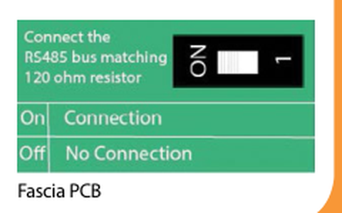

---

## Re-calibrating the edge

> This thermostat is factory set and need not re-calibrating under normal operation!

To calibrate, follow the steps below.

- Use the 'Left/Right' keys to scroll to the Power Icon.
- Press and hold `[✓]` to turn the display 'OFF'.
- Press and hold the `[✓]` and 'Down' keys together for 10 seconds.
  *The current temperature will appear on the display.*
- Use the 'Up/Down' keys to configure the new temperature value.
- Press the `[✓]` key to confirm the change and the display will go blank.
- Press the `[✓]` key once to turn the thermostat 'ON'.

## Error Codes

The edge will display an error code if there is a fault with the temperature sensor, these error
codes are explained below.

| Code | Meaning |
|---|---|
| **E0** | The internal sensor has developed a fault. |
| **E1** | The remote FLOOR probe has not been connected. / The remote FLOOR probe has not been wired correctly. / The remote FLOOR probe is faulty. |
| **E2** | The WIRELESS AIR SENSOR has not been paired correctly. / The WIRELESS AIR SENSOR has lost connection to the edge (check batteries). / The remote WIRELESS AIR SENSOR is faulty. |

---

## Wiring Diagrams

> This product must only be installed by a qualified electrician and comply with local installation
> regulations.

The terminal block is, left to right: **A · B · RT1 · – · A2 · A1 · N · L**, where **A/B** is the
Modbus interface, **RT1 / –** the floor sensor, and **A2 / A1** the switched output.

### EDGE Switch Live Output

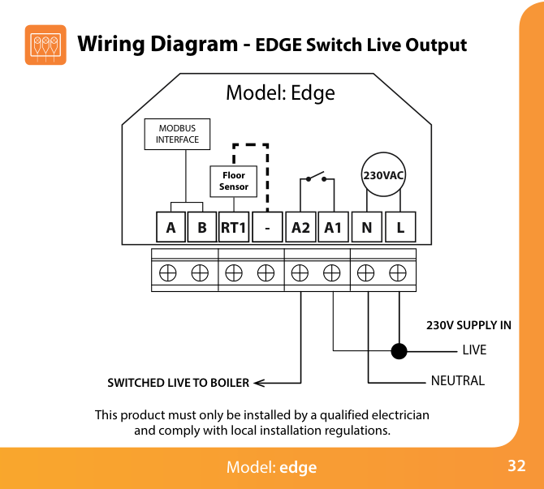

### EDGE Volt Free Output (Thermostat & Time Clock Modes)

LS & LR are normally the room thermostat connections.

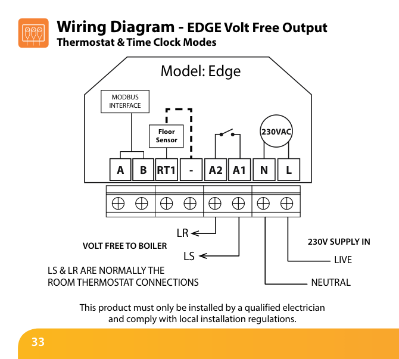

### EDGE to Valve

LS & LR are normally the room thermostat connections. To connect boiler consult boiler
manufacturer's diagram.

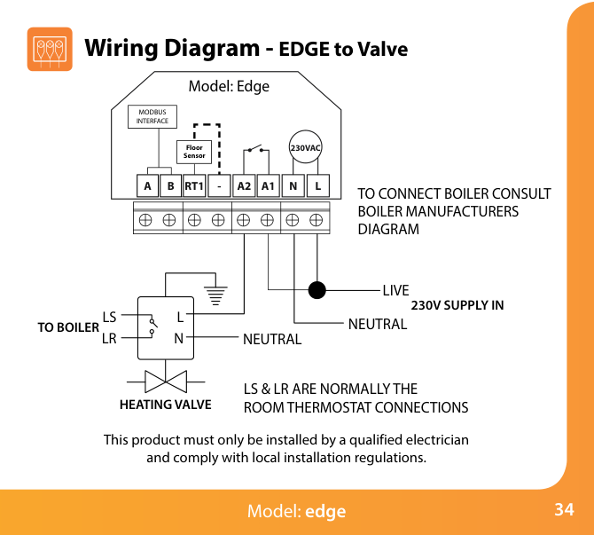

### EDGE Switch Live to UH8

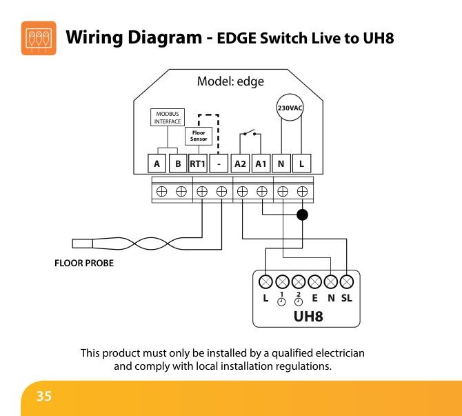

---

# Mode 2 — Time Clock

## LCD Display

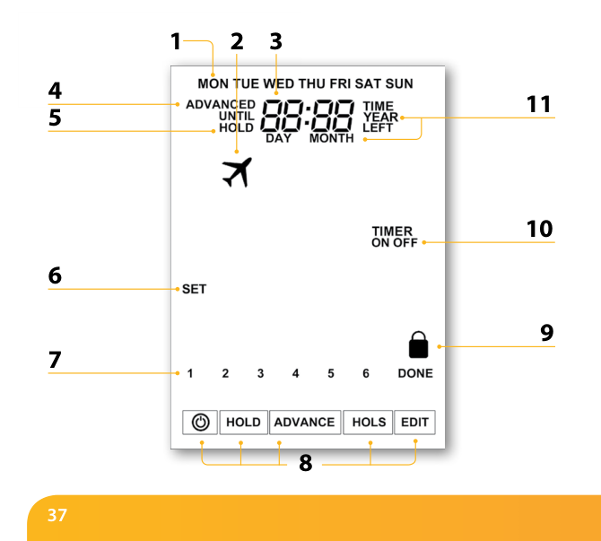

1. **Day Indicator** — Displays the day of the week.
2. **Holiday** — Displayed when the time clock is in holiday mode.
3. **Clock** — Time displayed in 24 hour format.
4. **Advanced Until** — Displayed when the edge is advanced to the next programmed level.
5. **Hold Left** — Displayed when a timer override is active, the remaining time will be shown.
6. **Set** — Indicates when changes are being made.
7. **Program Indicator** — Displayed during programming to show which period is being altered.
8. **Main Menu** — Highlighted display indicates selected option.
9. **Keypad Lock Indicator** — Displayed when the keypad is locked.
10. **Timer Status** — Displays the current status of the timed output.
11. **Time/Day/Month/Year** — Displays when setting the Clock/Calender or a Holiday Period.

---

## Setting the Switching Times

To program the switching times, follow these steps.

- Use the 'Left/Right' keys to scroll to 'EDIT'.
- Press `[✓]` to confirm selection.
- Use the 'Up/Down' keys to select the day/period to program.
- Press `[✓]` to confirm selection.
- Level '1' will now be highlighted and the 'ON' time will be displayed.
- Press `[✓]` to alter Level '1'.
- To set the 'ON' time, use the 'Up/Down' keys to set the hours, followed by `[✓]`, then use
  'Up/Down' to set the minutes.
- Press `[✓]` to confirm.
- To set the 'OFF' time, use the 'Up/Down' keys to set the hours, followed by `[✓]`, then use
  'Up/Down' to set the minutes.
- Press `[✓]` to confirm the settings.
- Press the 'Right' arrow key.
- Level '2' will now be highlighted and the current settings will be displayed.
- Press `[✓]` to alter Level '2' settings.
- Repeat these steps to set all periods.
- To blank or set a switching level period to unused, first select the switching level then set
  `--:--` in place of the time.
- When all switching times have been programmed use the 'Right' arrow key to highlight 'DONE' and
  press `[✓]`.

---

## Timer Advance

To boost the timed output 'ON' follow these steps.

- Use the 'Left/Right' keys to highlight 'Advance' then press `[✓]` twice.
  *Boost Left and the remaining time will now be displayed.*

**To cancel 'Advance'**

- While 'ADVANCE' is highlighted press `[✓]` twice.

## Timer Override

To override the timed output 'ON/OFF', follow these steps.

- Use the 'Left/Right' keys to highlight 'HOLD' then press `[✓]`.
- Use the 'Up/Down' keys to set the hours then press `[✓]`.
- Use the 'Up/Down' keys to set the minutes then press `[✓]`.
- Use the 'Up/Down' keys to set output On or OFF then press `[✓]` to confirm.

*Hold Left and the remaining time will now be displayed.*

**To cancel Timer Override**

- With 'HOLD' highlighted, press `[✓]` twice.

---

## Optional Settings Explained (Time Clock)

**Programming Mode:** The following program modes are available;

- **5/2 Day Programming** – 4 On/Off switching times for the weekdays and 4 On/Off switching times
  for the weekend.
- **7 Day Programming** – 4 individual On/Off switching times for each day.
- **24 Hours** – 4 On/Off switching times over a 24 hour period.

**Daylight Saving Time (DST):** is where the thermostat sets the clocks forward one hour from
Standard Time during the summer months, and back again in autumn, in order to make better use of
natural daylight.

**Communications ID:** To interface with building management systems using the standard Modbus
protocol.

## Optional Settings — Feature Table (Time Clock)

| Feature | Setting |
|---|---|
| Program Mode | `00` = 5/2 (Default), `01` = 7 Day, `02` = 24 Hour |
| Daylight Saving Time (DST) | `00` = Disabled (Default), `01` = Enabled |
| Communications ID | 01–32, `00` = Disabled |

*(The Time Clock table prints no feature numbers.)*

---

## Adjusting the Optional Settings (Time Clock)

- Use the 'Left/Right' arrow keys to highlight `[⏻]` then press and **hold** the `[✓]` button for
  3 seconds.
  *The display will go blank showing only 'Setup' and 'Clock'.*
- Press the 'Up' key followed by `[✓]` twice to access main feature menu.
- Use the 'Up/Down' keys to scroll through features.
- Use the 'Left/Right' keys to change feature setting.
- When all required changes have been made press `[✓]` to confirm settings and return to the blank
  display.
- Use the 'Down' key to select `[⏻]` then press `[✓]` once to power on.

---

## Replacing the Battery

In most cases the 3 volt lithium battery does not need replacing if the thermostat has a continual
power supply. Its sole purpose is to ensure correct time keeping during a power loss to the
thermostat.

To remove the battery use a small flat head screw driver or fingertip to push back the brass
retaining bracket. This will automatically release the battery. Insert the new battery **(positive
side up!)** by locating one end underneath the **holding clips** then pushing down on the opposite
end against the brass holding bracket.

> We advise that replacement of the lithium battery be carried out by a qualified professional.

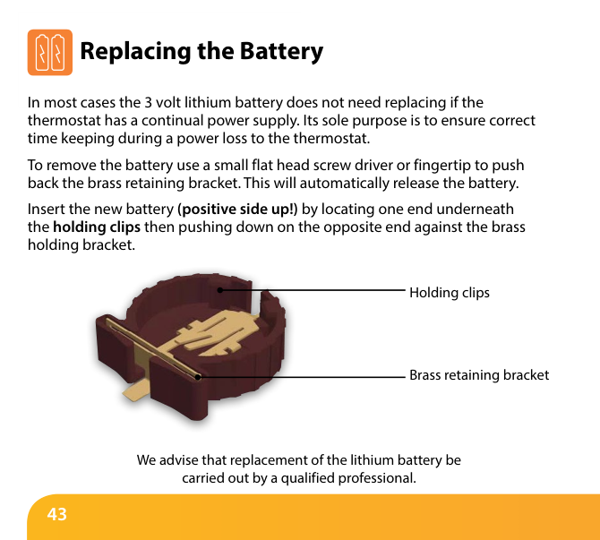

---

## Want More Information?

Call our support team on: **+44 (0)1254 669090**

Or view technical specifications directly on our website: **www.heatmiser.com**

Twitter: @heatmiseruk · Facebook: facebook.com/thermostats

*Rev. 1.1*
